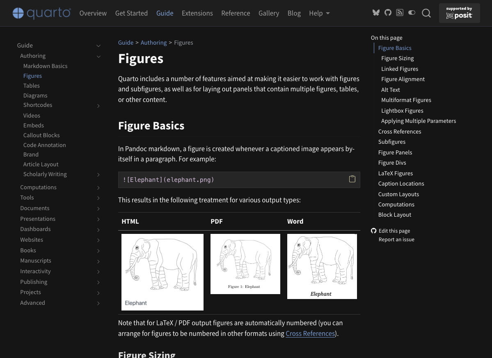

Quarto source documents use Markdown for text and add support for
configuration, executable code, callouts, citations, cross-references, and
other publishing features. The examples below cover frequent course edits;
see the [Quarto Markdown guide](https://quarto.org/docs/authoring/markdown-basics.html)
for a full reference.

## Text structure

```markdown
# Main heading
## Section heading

This is **important** and this is *emphasized*.

- One item
- Another item

[Quarto documentation](https://quarto.org/)
```

## Figures 

Figures are included using the syntax shown below

```markdown
{width=70%}
```

{width=70%}

Paths are relative to the source document unless the project configures
otherwise. Preview after adding or moving a figure. 


In the above example `width=70%` means the figure takes up 70% of the available text space. See the [Quarto documentation on figures](https://quarto.org/docs/authoring/figures.html) for customization options.

## Mathematics

Math is written using LaTeX syntax, like 

```markdown
Inline notation uses $K_M$, while a displayed equation uses:

$$
v = \frac{V_{\max}[S]}{K_M + [S]}
$$
```

Inline notation uses $K_M$, while a displayed equation uses:

$$
v = \frac{V_{\max}[S]}{K_M + [S]}
$$

## Displayed code

A normal fenced code block is shown to the reader but is not executed:

````markdown
```python
rate = concentration / time
```
````

An executable cell has braces around its language and requires a project that
supports execution:

<pre><code>```&#123;python&#125;
rate = concentration / time
rate
```</code></pre>

## Callouts

Quarto provides callouts for information that should stand out:

```markdown
::: {.callout-tip}
Remember to use concentrations in mol/L.
:::
```

In projects with the teaching-tools `callout-solution` extension, use
`.callout-solution` for an answer callout that should appear only in
instructor output. Ordinary callouts remain suitable for material shown to
both audiences. Below each of the ordinary callouts are shown

::: {.callout-note}
This is a note
:::

::: {.callout-tip}
This is a tip
:::

::: {.callout-important}
This is an "important"
:::

::: {.callout-caution}
This is a caution
:::

::: {.callout-warning}
This is a warning
:::

Each callout can also optionally include whether it can be folded using 

```
::: {.callout-warning collapse="true"}
This is a warning that is initial collapsed. It might be collapsed because it has a 
lot of text.. 
:::
```

::: {.callout-warning collapse="true"}
This is a warning that is initial collapsed. It might be collapsed because it has a 
lot of text.. 


:::

## Front matter

Many documents begin with YAML configuration:

```yaml
---
title: "Enzyme kinetics"
toc: true
---
```

Edit front matter carefully: indentation and punctuation affect parsing and
may prevent rendering if invalid.
