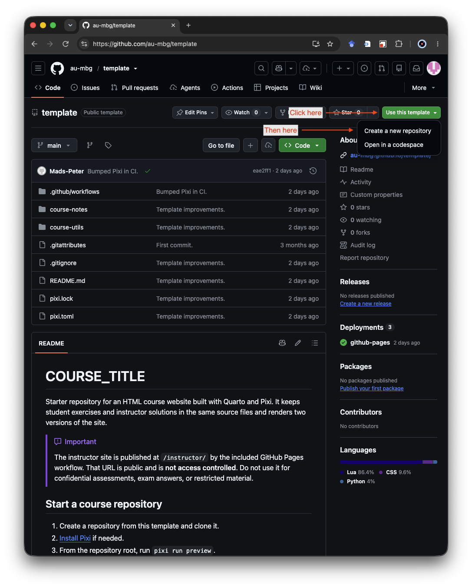
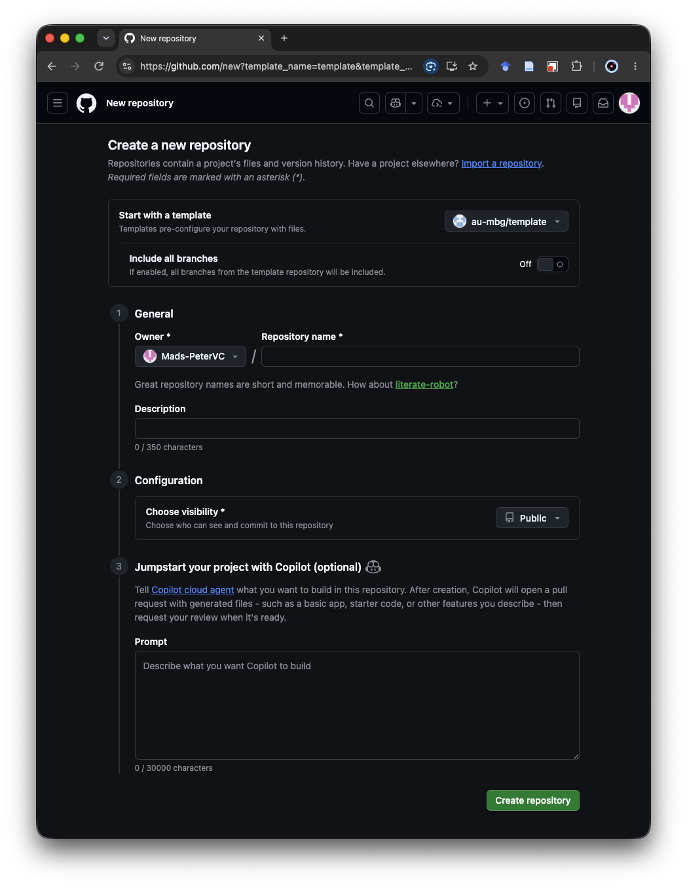
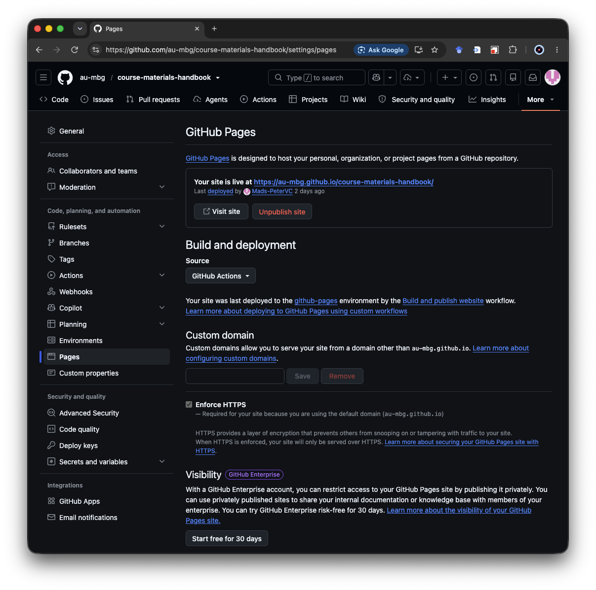

Use the [course repository template](https://github.com/au-mbg/template) when
starting a new Quarto course website. It provides a reproducible Pixi
environment, student and instructor versions, example material, and a GitHub
Pages publication workflow.

This page follows the complete setup from creating the repository to opening
the published website. For the reasoning behind the structure, see
[Repository layout](../authoring/layout.qmd). 

## Before you start

You need:

- a GitHub account;
- permission to create repositories in `au-mbg`, or another suitable owner;
- [Git configured](git.qmd); and
- [Pixi installed](install.qmd).

The `au-mbg` organization is the recommended owner for MBG course material.
If it is not available in GitHub's owner selector, ask an organization owner
for access or create the repository under another agreed owner.

## Create the GitHub repository

Open [`au-mbg/template`](https://github.com/au-mbg/template), select **Use this
template**, and then select **Create a new repository**.

{width="80%" fig-align="center" .lightbox} 

On the creation form:

1. Keep `au-mbg/template` selected under **Start with a template**.
2. Select `au-mbg` as the owner when the course belongs to the organization.
3. Enter a short repository name, for example `example-course`.
4. Add a brief description that identifies the course.
5. Choose **Public** for ordinary course material intended for publication.
6. Leave **Include all branches** disabled; the template uses its default
   branch.
7. Select **Create repository**.

{width="80%" fig-align="center" .lightbox}

GitHub creates an independent repository containing the template files and
history-free starting content. Later template changes are not applied to the
new course automatically.

## Clone and customize the course

On the new repository page, select **Code**, copy its HTTPS URL, and clone it:

```bash
git clone https://github.com/au-mbg/COURSE_REPOSITORY.git
cd COURSE_REPOSITORY
```

Use the actual owner and repository name if they differ. The template README
is the authoritative setup checklist. Search the repository for its
distinctive placeholders and replace each one:

| Placeholder | Replace with |
| --- | --- |
| `COURSE_TITLE` | The title shown to readers |
| `COURSE_REPOSITORY` | The GitHub repository name |
| `COURSE_AUTHOR` | The maintainer's name and email |
| `GITHUB_ORGANIZATION` | The GitHub owner, normally `au-mbg` |

Replace the example homepage, lesson, and image with course material. Adjust
the sidebar in `course-notes/_quarto.yml` when adding or renaming pages. See
[Organizing website content](../authoring/organizing-website-content.qmd) for
navigation patterns.

## Preview both versions

From the repository root, preview the learner-facing website:

```bash
pixi run preview
```

Then check the answer-bearing version:

```bash
pixi run preview instructor
```

Confirm that shared material appears in both versions, student scaffolding is
usable, and worked solutions appear only in the instructor version. See
[Student & Instructor versions](../daily_workflow/student-instructor.versions.qmd)
for the authoring syntax and visibility rules.

## Record the initial customization

Stop the preview, inspect the changes, and create the first course-specific
commit:

```bash
git status
git diff
git add README.md pixi.toml course-notes course-utils
git commit -m "Customize course template"
git push
```

If the optional `course-utils` package was removed rather than customized, do
not include that path. For more detail, see the [Git workflow](../daily_workflow/git-basics.qmd).

## Enable GitHub Pages

In the new repository on GitHub:

1. Open **Settings**.
2. Select **Pages** under **Code, planning, and automation**.
3. Under **Build and deployment**, set **Source** to **GitHub Actions**.

{width="80%" fig-align="center" .lightbox}

The template's workflow runs after a push to `main`. Open the repository's
**Actions** tab and select **Build and publish website** to follow its build
and deployment jobs. The [GitHub Pages & Actions](../maintenance/github-pages.qmd)
page explains how to read the workflow status and investigate failures.

When deployment completes, GitHub shows the site URL on the Pages settings
screen and in the workflow deployment summary. With the usual organization
and repository names, the address is:

```text
https://au-mbg.github.io/COURSE_REPOSITORY/
```

The student website is published at that root address. The instructor website
is published below it at `/instructor/`.

::: {.callout-warning title="Instructor material is public"}
The `/instructor/` address is not access controlled. Anyone who knows or finds
the URL can open it. Do not publish confidential assessments, exam answers,
personal information, or other restricted content there.
:::

## Where to go next

- [Repository layout](../authoring/layout.qmd) explains the role of each area
  in the generated repository.
- [Organizing website content](../authoring/organizing-website-content.qmd)
  covers pages, sidebars, and navigation.
- [Previewing](../daily_workflow/preview.qmd) and
  [Rendering](../daily_workflow/render.qmd) cover the normal local workflow.
- [Student & Instructor versions](../daily_workflow/student-instructor.versions.qmd)
  shows how to write exercises and solutions in shared source documents.
