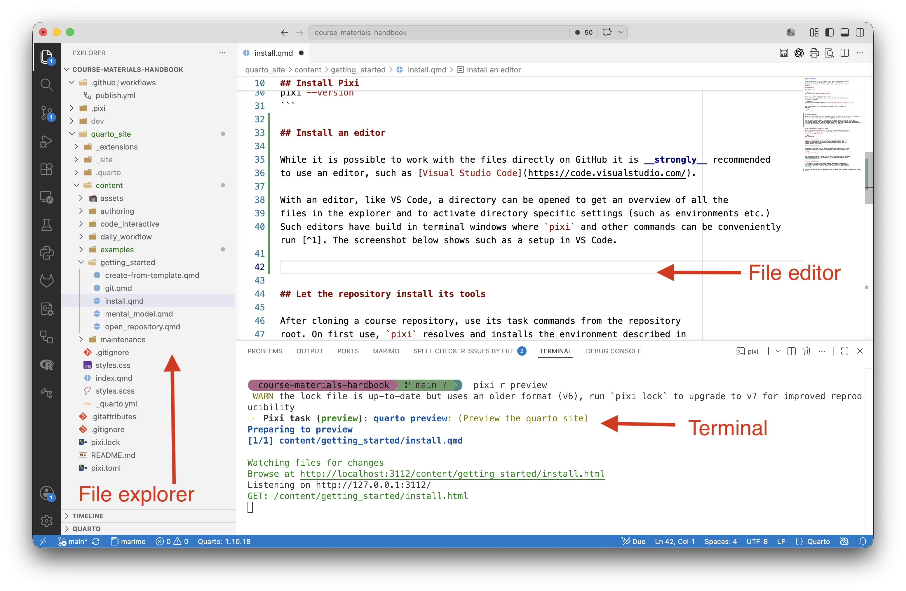

Course repositories use [`pixi`](https://pixi.prefix.dev/latest/) to install
the required version of Quarto and any Python, R, or command-line
dependencies. In the usual workflow, `pixi` is the only tool you install
manually.

## Install Pixi

On macOS or Linux:

```bash
curl -fsSL https://pixi.sh/install.sh | sh
```

On Windows, use the installer linked from the
[Pixi installation guide](https://pixi.prefix.dev/latest/installation/) or
run this in PowerShell:

```powershell
powershell -ExecutionPolicy Bypass -c "irm -useb https://pixi.sh/install.ps1 | iex"
```

Open a new terminal after installation, then check that the command is
available:

```bash
pixi --version
```

## Install an editor 

While it is possible to work with the files directly on GitHub it is ***strongly*** recommended 
to use an editor, such as [Visual Studio Code](https://code.visualstudio.com/). 

With an editor, like VS Code, a directory can be opened to get an overview of all the 
files in the explorer and to activate directory specific settings (such as environments etc.)
Such editors have build in terminal windows where `pixi` and other commands can be conveniently run [^1]. The screenshot below shows such as a setup in VS Code. 

{.lightbox width="90%" fig-align="center"}

In VS Code a directory can be opened in this way from the `File > Open Folder`-menu or using the keyboard shortcut .

## Let the repository install its tools

After cloning a course repository, use its task commands from the repository
root. On first use, `pixi` resolves and installs the environment described in
`pixi.toml` or `pyproject.toml`.

```bash
pixi run preview
```

Tasks are repository-specific. For example, some repositories require an
argument selecting a learner-facing or answer-bearing variant. Read
`README.md` and inspect the task configuration before assuming that the
command above is sufficient.

## Git and authentication

You normally also need `git` to obtain and submit course materials. If it is
not already installed, a repository may support installing it through Pixi:

```bash
pixi global install git
```

Some repositories define a helper such as `pixi run github-auth` to configure
GitHub authentication. Use it only when it is documented or present in the
repository task manifest.

## Manual installations

It is possible to install Quarto and language dependencies independently.
That route is intended for maintainers who need to modify or debug the build
environment; it is more likely to differ from the versions used by automated
publishing.

[^1]: And be used for general navigation, which is easier than the explorer once you get a hang for it. 