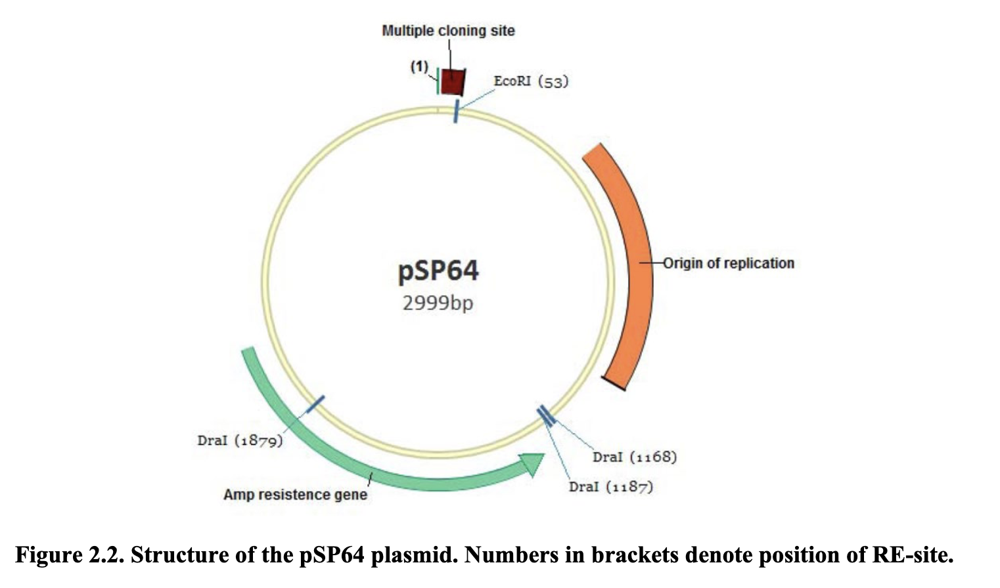
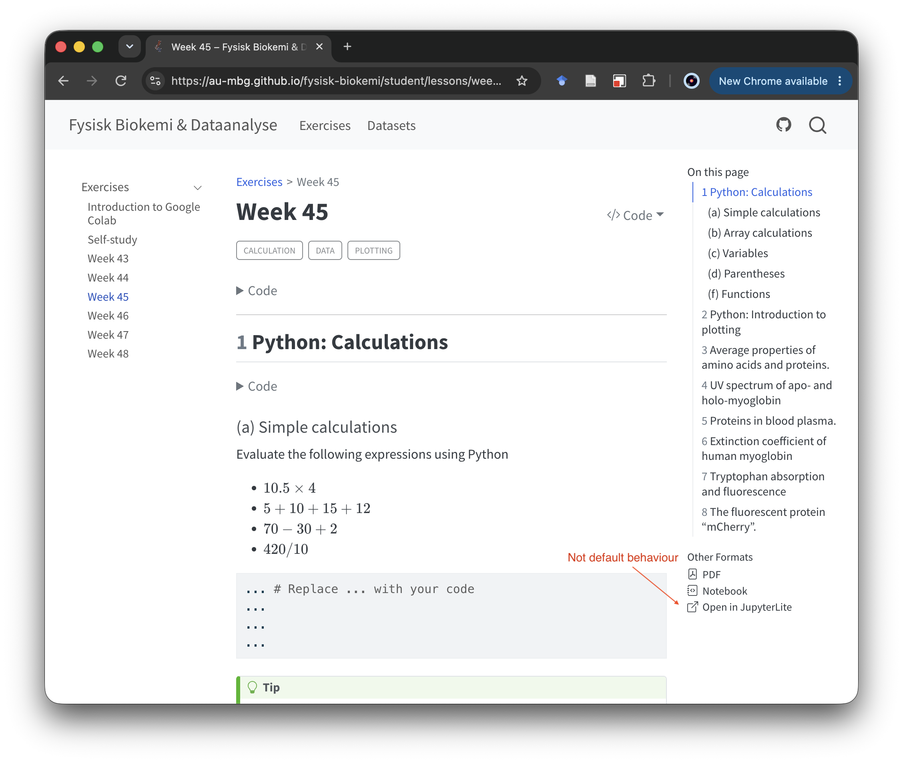
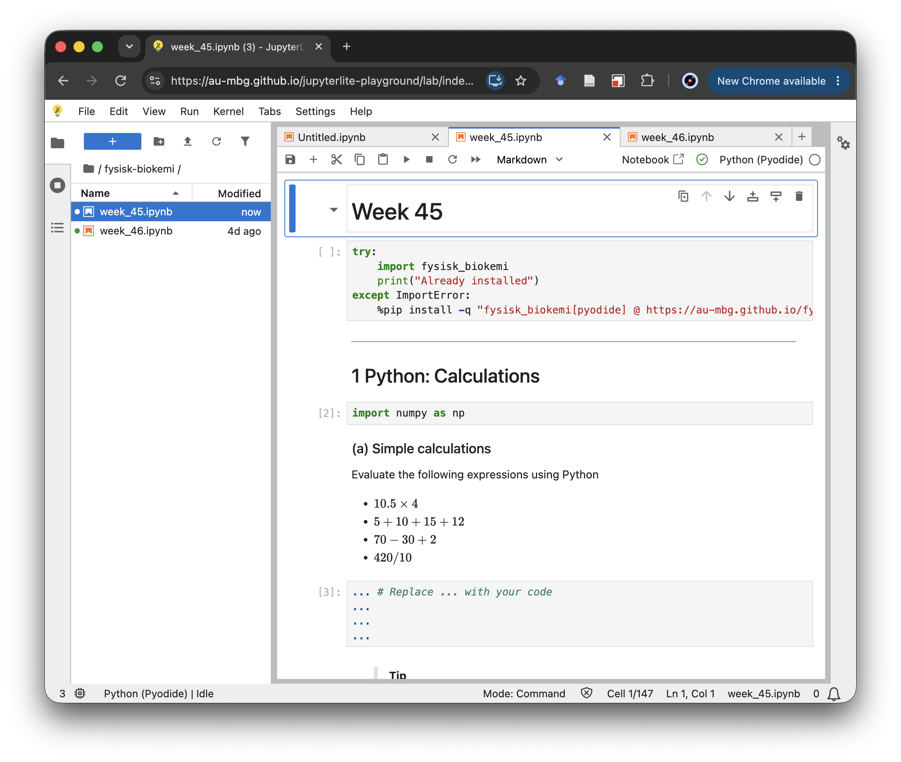

```{=html}
<style>
.custom-quote {
  margin-top: 1em;
  margin-bottom: 1em;
  padding-left: 1em;
  border-left: 0.25rem solid #dee2e6; 
  color: #6c757d; 
  line-height: 1.1;
}

/* Strips Quarto's default paragraph spacing inside this class */
.custom-quote p {
  margin-top: 0 !important;
  margin-bottom: 0 !important;
}

/* Restores spacing ONLY for intentional double-returns (blank lines) */
.custom-quote p + p {
  margin-top: 1em !important;
}
</style>
```

::: {.callout-note}
These are my personal opinions, as of September 2026, on LLM usage, based on experience using various tools, mostly [Codex](https://openai.com/codex/), to assist with developing teaching materials in the Quarto framework. 
:::

In the context of teaching, LLMs pose a challenge in terms of ensuring that students achieve a course's learning objectives when an LLM is always ready to assist. This note, however, is not about that; it is about how to use LLMs to develop teaching materials. 

Personally, I don't think it is helpful to use LLMs to write prose. It is typically easy to detect because it follows certain patterns and has a tone that is easily identifiable, and, more importantly, because many (most?) people get tired of reading LLM output. Nonetheless, LLMs are extremely useful for: 

- Debugging and fixing technically difficult issues, e.g. "Why is GitHub CI failing?" or "Why is my widget not behaving correctly?"
- Drafting and iterating on programmatic problems, such as creating a [Manim animation](../examples/manim/manim.qmd) or [Quarto extensions](quarto-extensions.qmd).
- Working with programming languages in which one is not an expert, such as [D3.js](../examples/d3_demo.qmd).

The Quarto framework is very well suited for working with LLMs, as all files are plain-text `.qmd` documents. Importantly, outputs are not just text; they can be figures, videos, code, interactive code, widgets, and so on. 

## When to use LLMs? 

This is obviously subjective, but one category where applying LLMs can be advantageous is problems or targets where verifying the output is simple. Consider these two situations: 

- *Situation 1*: You use an LLM to reduce several sources, e.g. textbooks and papers, to a set of lecture notes. While this may reduce the material by, for example, 90%, the result may still easily be 30–40 pages. While there are various ways of verifying the content, it most likely requires reading through the entire thing, probably several times. 
- *Situation 2*: You use an LLM to produce a widget that explores a particular phenomenon. The output of the LLM in this case is `code`; it might be several hundred lines of code that uses tools (and possibly even the language itself) that you are not familiar with. Verifying the code may therefore be difficult, but verifying the widget itself is likely quite easy. 

What counts as adequate verification depends on the intended use. A teaching widget designed to build intuition does not need to meet the same standard as software used to produce publishable scientific results. It should behave consistently with the concept being taught, and its simplifications should not lead students toward the wrong conclusion. That does not necessarily require validating every numerical or implementation detail to research-software standards.

## How to use LLMs 

My first recommendation is to use a tool that can be given access to directly read and modify the relevant files, such as 

- [Codex](https://openai.com/codex/)
- [Copilot CLI](https://github.com/features/copilot/cli)
- [Claude Code on desktop](https://code.claude.com/docs/en/desktop)
- [Claude Code](https://code.claude.com/docs/en/overview)

These tools are orders of magnitude more useful than an "old-school" ChatGPT-esque web interface. This is because they are able to read relevant files, such as configuration files (e.g. `_quarto.yml`) and source documents (e.g. `.qmd` documents), and they are able to edit all of these documents easily[^1]. 

::: {.callout-warning}
The ability of these tools to read and change files on disk is also potentially problematic, and precautions should be taken, such as

- Using version control (e.g. `git`) such that modified files can be recovered. 
- Reviewing diffs, such as those provided by Codex, that highlight what was changed. 
- Limiting permissions such that critical files are not changed. 
- Being mindful of what an LLM is given access to read, such as credentials or personal data.

::: 

The next question is how to interact with these tools. I generally don't think one 
needs to figure out some incredibly detailed master prompt or engage in some archaic 
"prompt engineering." When used for "targets" that are easy to verify, doing several iterations is easier than trying to one-shot it with a perfect prompt. 

Some functionality, such as the ["Plan Mode"](https://learn.chatgpt.com/guides/best-practices#plan-first-for-difficult-tasks) of Codex, can make it easier to arrive at a good first draft that can then be iterated on. This lets Codex ask questions that guide how it plans to perform a task. This can reveal technical nuances, clarify details, and, in my experience, generally lead to a better first draft. 

## Examples

### Creating a Manim animation

I wanted to use `manim` to create an animation that explains calculating fragment sizes for a circular plasmid; see the figure below. 

{fig-align="center"}

In a chat session that I had used to help me set up and configure Manim in Quarto documents, I asked:

::: {.custom-quote}
Figure 2.2 of this PDF (path/redacted) shows a pSP64 plasmid. 

In an exercise students are asked to calculate the fragment sizes, they often find this difficult because it invovles a modules operation (though they don't know that and it is not framed like that) as the plasmid is circular. 

Lets try creating an example in dev/manim that shows this.
::: 

This resulted in the animation below:



This was not particularly good, so I continued:

::: {.custom-quote}
There's something awkward with the sequence of the fragments, they are position awkwardly. 

I think ideally they should be represented either by overlapping the full or have a slightly larger radius but centered on the same point and with the same angle. 

Also the last one doesn't fade out.
::: 

This then resulted in:



Again, I was not completely satisfied, so I wrote:

::: {.custom-quote}
For the last fragment perhaps we could have two arcs one for the 1120 part and one for the 53 part in a slightly diferent color to make it more clear
:::

This produced:



This is the example shown in [Manim](../examples/manim/). It may not be perfect yet, but it shows how iteration with an LLM can improve this type of output step by step. 

### Creating a Shiny Widget

After having set up and created the first few examples shown for [Shiny Widgets](../examples/shiny.qmd), I asked in a Codex session:

::: {.custom-quote}
I've been adding examples & ideas to the handbook to hopefully serve as inspiration for people implementing material, for example `manim.qmd` and `molstar.qmd`
I'm now working on some examples for ShinyLive `shiny.qmd`, I'd like to make one biologically motivated example. We should start by coming up with some ideas of what that could be
::: 

Here I linked to different pages and the then-current Shiny page to give the LLM context. I received this response: 

::: {.custom-quote}
Here are biologically motivated ShinyLive ideas that should fit well as compact handbook examples:

1. Enzyme Kinetics Explorer
   Interactive Michaelis-Menten plot:
   - sliders for Vmax, Km, substrate concentration range
   - plot reaction velocity vs. substrate concentration
   - optional Lineweaver-Burk tab
   - biologically familiar, mathematically simple, visually clear

2. Logistic Growth With Carrying Capacity
   Simulate population or bacterial growth:
   - sliders for growth rate, initial population, carrying capacity
   - plot population over time
   - optional marker for exponential vs. saturation phase
   - easy to explain and robust in browser-only ShinyLive
   
3. Allele Frequency Drift Simulator
   Wright-Fisher-style genetic drift:
   - controls for population size, starting allele frequency, generations
   - simulate several replicate trajectories
   - shows stochasticity and fixation/loss
   - pedagogically strong because interaction changes intuition quickly

4. Dose-Response Curve Explorer
   Model drug response or inhibition:
   - sliders for IC50/EC50, Hill coefficient, max effect
   - plot response curve
   - optionally show selected dose and predicted response
   - relevant to pharmacology, toxicology, and molecular biology

5. PCR Amplification Simulator
   Visualize DNA copy number over cycles:
   - controls for efficiency, starting copies, cycle number
   - plot ideal vs. imperfect amplification
   - optional threshold line for qPCR-style Ct interpretation
   - very approachable and visually satisfying

6. Gene Expression Noise
   Simulate single-cell expression distributions:
   - sliders for mean expression and noise/dispersion
   - histogram or violin-like plot of simulated cells
   - show how identical cells can have heterogeneous expression
   - good bridge between biology and statistics

My strongest recommendation is enzyme kinetics or genetic drift.
Enzyme kinetics is the safest handbook example: deterministic, small code, no special dependencies, and immediately recognizable. Genetic drift is more distinctive and interactive: changing population size makes the concept “click,” but the code is slightly more involved because it uses random simulation.
::: 

I then wrote:

::: {.custom-quote}
I like both the enzyme kinetics and the genetric drift ideas. 
However, I have done michealis-menten many times and I am bored with it. So lets explore the genetic drift instead. 

Can you implement that in `shiny.qmd`. Start by making a plan and ask questions to ensure we're aligned, keep in mind that I am not a microbiologist/geneticist.
::: 

For this, I enabled "Plan Mode," so Codex asked several questions and then presented a plan, which I've reproduced below. 

::: {.callout-tip title="Codex's plan" collapse="true"}
# Add A Genetic Drift ShinyLive Example

## Summary
Add a third example to `shiny.qmd` showing neutral genetic drift as an interactive ShinyLive widget. The example will be aimed at non-geneticists: a “trait variant” changes frequency over generations because each new generation is a random sample of the previous one.

## Key Changes
- Add a new section after the sine-wave example, titled `Biological example: Genetic drift`.
- Include a short scaffold before the widget:
  - explain that the plot tracks the frequency of one neutral trait variant;
  - state that no selection or mutation is modeled;
  - highlight that smaller populations drift more strongly.
- Implement a `shinylive-python` app using only `shiny`, `numpy`, and `matplotlib`.
- Use a simple neutral sampling model:
  - each simulated population starts with the selected variant frequency;
  - each generation samples `N` individuals from the current frequency using a binomial draw;
  - frequencies are plotted from generation 0 through the selected final generation.

## Widget Design
- Sidebar controls:
  - `Population size`: integer slider, default around `100`, range roughly `20-500`.
  - `Starting frequency`: slider from `0.05-0.95`, default `0.5`.
  - `Generations`: integer slider, default around `50`, range roughly `10-200`.
  - `Simulated populations`: integer slider, default around `20`, range roughly `1-50`.
  - `Resimulate`: action button that changes the random seed without changing parameters.
- Main output:
  - line plot of many drift trajectories, one per simulated population;
  - y-axis fixed to `0-1` and labeled as variant frequency;
  - x-axis labeled as generation;
  - subtle horizontal reference line at the starting frequency.
- Summary output below the plot:
  - report how many simulated populations lost the variant by the final generation;
  - report how many reached 100% frequency by the final generation;
  - use plain language such as “lost” and “took over” rather than specialist terminology.

## Test Plan
- Render or preview the Quarto page enough to confirm the `shinylive-python` block is syntactically valid.
- Verify the widget responds to slider changes and the `Resimulate` button.
- Check edge cases manually:
  - `Simulated populations = 1`;
  - small population size with many generations;
  - large population size with few generations.
- Confirm the page still matches the lightweight style of the existing Shiny examples.

## Assumptions
- Keep the model drift-only: no selection, mutation, dominance, diploidy, or Hardy-Weinberg assumptions.
- Treat `Population size` as the number of sampled individuals in a deliberately simplified teaching model.
- Keep explanatory text concise so the page remains an examples page, not a genetics lesson.

::: 

I accepted this plan without any qualifications. After Codex had implemented the first draft of the widget[^2], I responded:

::: {.custom-quote}
To make it a little bit more visually exciting lets try this: Color each line according to the final variant frequency using an appropriate colormap (probably just between two colors) such that a frequency of 1 is fully one color, 0.5 is a mix and 0 is the other color (and interpolations in between).
::: 

The result is the widget shown [here](../examples/shiny.qmd#biological-example-genetic-drift).

I think a few key takeaways from this are:

- It's useful to be able to provide minimal examples of what you're looking for. In this case, I had other small Shiny widgets that could provide context for what I wanted. 
- Using "Plan Mode" resulted in a pretty good first draft. The widget's observed behaviour was correct: smaller populations drifted more strongly, and repeated simulations produced different trajectories. Subsequent work focused on slightly adjusting the visual aspects.

### Creating a custom Quarto extension

Quarto extensions are code that add to or alter the behaviour of Quarto. In this case, I wanted an extension that would allow me to link to a JupyterLite instance so that a webpage could be opened as a notebook in JupyterLite. This required a filter extension, which is typically implemented in Lua—a language with which I have no experience. Writing Quarto extensions has not provided enough incentive for me to learn it. 

The screenshot on the left below shows the type of link I wanted to have, and the screenshot on the right shows the intended result of clicking the link. 
Note that these screenshots are the result of the produced extension, I did not provide these to the LLM. 

::: {layout-ncol=2}
{.lightbox}

{.lightbox}
:::

For this, I used Codex with access to the repository where I keep [Quarto extensions](https://github.com/au-mbg/quarto-teaching-tools). In "Plan Mode," I wrote:

::: {.custom-quote}
I have been working on using JupyterLite rather than Google Colab. 
I'd like to make an extension that adds links to a JupyterLite instance rather than Google Colab. 

We can assume that the JupyterLite instance has the fromURL extension (jupyterlab-open-url-parameter = "==0.4.0") so I think it can work very similarly to the Google Colab link extension we have currently. It just needs additional parameters of the address of the JupyterLite page and an optional directory name for the course. 

Please ask any relevant questions so we can make a detailed and aligned plan for this.
::: 

After asking a few questions[^3], Codex produced the following plan:

::: {.callout-tip title="Codex's plan" collapse="true"}
# Add a JupyterLite Link Extension

## Summary

Create a new, independent `jupyterlite-link` Quarto extension modeled on `colab-link`. It will add an “Open in JupyterLite” entry to HTML pages, loading the generated notebook from raw GitHub through `fromURL`. The existing Colab extension remains unchanged, and both links may appear together.

## Public Configuration

```yaml
filters:
  - jupyterlite-link

teaching:
  jupyterlite:
    url: https://example.org/lite/lab/index.html
    repo: owner/repository
    branch: built-notebooks
    root: built_notebooks
    notebook-profile: student
    course-directory: course-name
    text: Open in JupyterLite
    icon: box-arrow-up-right

jupyterlite: true
```

- `jupyterlite: true` opts an individual document in.
- `url` is required and must be the exact JupyterLite application page.
- `repo` is required in `owner/repository` form.
- `branch`, `root`, and `notebook-profile` retain the Colab extension’s defaults shown above.
- `course-directory` is optional. When present, it becomes `fromURLToFolder`; when absent, that query parameter is omitted.
- `text` and `icon` default to `Open in JupyterLite` and `box-arrow-up-right`.

The generated source and launch URLs will conceptually be:

```text
https://raw.githubusercontent.com/{repo}/{branch}/{root}/{notebook-profile}/{document-basename}.ipynb

{jupyterlite-url}?fromURL={encoded-raw-url}&fromURLToFolder={encoded-course-directory}
```

## Implementation Changes

- Add a sibling `extensions/jupyterlite-link` package with its own manifest, Lua filter, example, README, and generated-example ignore rules.
- Reuse the established HTML-only behavior: determine the notebook name from Quarto’s output/input filename, inject the link into the existing **Other Formats** list, or create that block when absent.
- Construct and percent-encode the raw GitHub URL and query values. Append parameters safely if the configured JupyterLite URL already has a query string, while preserving any fragment.
- Validate required configuration and fail rendering with extension-specific messages for missing/invalid `url`, invalid `repo`, or an undeterminable document basename.
- Treat surrounding slashes consistently in path and directory settings. An empty `course-directory` is equivalent to it being unset.
- Keep link insertion idempotent. If both `colab: true` and `jupyterlite: true` are enabled, retain separate entries in the same list.
- Document installation and configuration in both the repository README and the extension README, including the assumed `jupyterlab-open-url-parameter == 0.4.0` dependency.

## Test Plan

- Render the example and verify the resulting HTML contains the expected JupyterLite link and raw GitHub notebook URL.
- Verify default branch, root, notebook profile, label, and icon behavior.
- Verify `course-directory` produces `fromURLToFolder`, and omission produces no destination parameter.
- Exercise URL encoding with spaces and reserved characters, plus JupyterLite URLs that already contain query parameters or fragments.
- Verify non-HTML output and documents without `jupyterlite: true` remain unchanged.
- Verify missing/invalid required metadata fails with clear diagnostics.
- Render with both link filters enabled and confirm both entries appear without duplication.

## Assumptions

- Notebook artifacts are publicly accessible from `raw.githubusercontent.com`.
- The JupyterLite deployment already includes `jupyterlab-open-url-parameter == 0.4.0`.
- Only one notebook is imported per document.
- The extension generates links only; producing and publishing notebooks and operating the JupyterLite deployment remain outside its responsibilities.

:::

I accepted the plan, and the resulting implementation worked as intended. I verified it on a course website by checking that the generated links opened the corresponding notebooks in the configured JupyterLite instance. 

In this case, my prompt provided various technical details, and the project repository already had a similar extension for Google Colab, both of which I suspect added enough context to make this a relatively easy task. 

### Help getting started with course editing 

One can also use these LLM/AI's for general help with working with course material, as an example I asked the following 

::: {.custom-quote}
I am part the teaching team for a university course that uses this repository for teaching materials

[https://github.com/au-mbg/fysisk-biokemi](https://github.com/au-mbg/fysisk-biokemi)

I have been given this handbook as a reference manual.

[https://au-mbg.github.io/course-materials-handbook/](https://au-mbg.github.io/course-materials-handbook/)

Please help me get started, I need to make some small edits to the some exercises.
::: 

I had given the agent access to an empty directory and after two minutes of thinking it responded with 

::: {.custom-quote}
You’re ready to edit. I cloned the course repository into:

[fysisk-biokemi](/Users/au616397/Repositories/mbg/courses/test_response/fysisk-biokemi)

Exercises are stored in:

[course/lessons/exercises](/Users/au616397/Repositories/mbg/courses/test_response/fysisk-biokemi/course/lessons/exercises)

To preview the instructor version:

```bash
cd /Users/au616397/Repositories/mbg/courses/test_response/fysisk-biokemi
pixi run preview master
```

To preview the student version:

```bash
pixi run preview student
```

Exercises are Quarto `.qmd` files. Mark an instructor-only solution like this:

````markdown
```{python}
#| solution: true

answer = 42
print(answer)
```
````

Mark a student exercise cell like this:

````markdown
```{python}
#| exercise: true
#| eval: false

# Add your code here
...
```
````

Before committing, review and render your changes:

```bash
git diff
pixi run render master
git status
```

Useful references:

- [Authoring guide](/Users/au616397/Repositories/mbg/courses/test_response/fysisk-biokemi/notes/authoring.md)
- [Git workflow](/Users/au616397/Repositories/mbg/courses/test_response/fysisk-biokemi/notes/git.md)
- [Repository README](/Users/au616397/Repositories/mbg/courses/test_response/fysisk-biokemi/README.md)

Tell me which exercise you want changed and describe the edits, and I can implement and check them for you.
::: 

At which point it had verified that `pixi` was installed on my computer, used `git` to install it and had made the repository ready for me to start editing.

[^1]: Because they are plain text, the advantages of plain text over technically weird formats such as `.docx` cannot be overstated. 

[^2]: I don't have an easily accessible record of it, so you can only see my response to it.

[^3]: Unfortunately, I don't remember the details.
