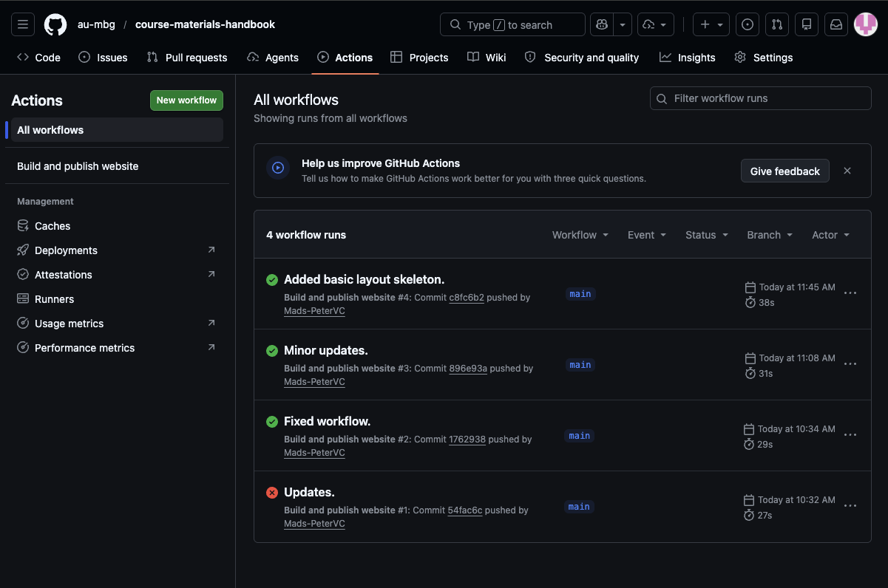
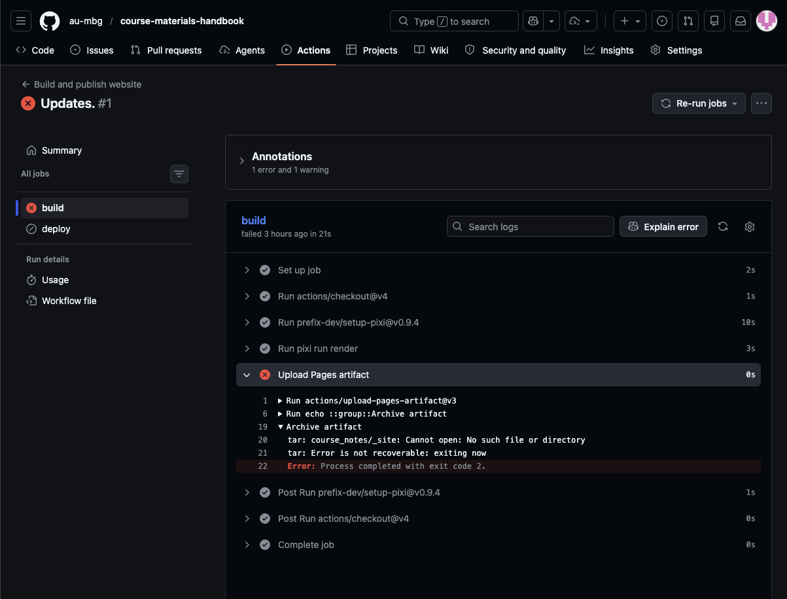

Many course repositories publish rendered websites through GitHub Actions and
GitHub Pages. A contributor changes source locally, pushes a commit, and lets
the configured workflow reproduce the final build.

## Typical publication flow

```{mermaid}
flowchart LR
    A["Push commit to main"] --> B["GitHub Actions workflow"]
    B --> C["Set up Pixi environment"]
    C --> D["Run render task"]
    D --> E["Upload generated site"]
    E --> F["Deploy GitHub Pages"]
```

In the existing site projects, the workflow commonly runs on pushes to
`main`, installs Pixi, executes `pixi run render` or
`pixi run render-all`, uploads an output directory such as
`course_notes/_site`, and deploys it to Pages.

## GitHub Actions

The publishing workflow is configured using a GitHub action, these are found in the `.github/workflows/`-directory of the project. These will typically look like the one below 

```yaml
name: Build and publish website

on: # <1> 
  push:
    branches: [main]
  workflow_dispatch:

permissions: # <2> 
  contents: read
  pages: write
  id-token: write

concurrency:
  group: pages
  cancel-in-progress: false

jobs: # <3>
  build: # <4> 
    runs-on: ubuntu-latest # <5>
    steps:
      - uses: actions/checkout@v4 # <6>

      - uses: prefix-dev/setup-pixi@v0.9.4 # <7>
        with:
          pixi-version: v0.66.0
          cache: true
      - run: pixi run render # <8>

      - name: Upload Pages artifact # <9>
        uses: actions/upload-pages-artifact@v3
        with:
          path: quarto_site/_site

  deploy: # <10> 
    needs: build
    runs-on: ubuntu-latest
    environment:
      name: github-pages
      url: ${{ steps.deployment.outputs.page_url }}
    steps:
      - name: Deploy to GitHub Pages
        id: deployment
        uses: actions/deploy-pages@v4
```
1. Declare the rules for when the action/workflow is run
2. Declare what action is allowed to do/interact with
3. List the steps that are part of the workflow.
4. Declare an invidual step name, here the `build`
5. Choose the type of machine the step runs on. 
6. Checkout the repository
7. Install dependencies using `pixi`
8. Render the site
9. Upload the generated site as an artifact 
10. Deploy the site to GitHub Pages

This will typically not need to be edited after it has been set up. See [GitHub Actions documentation](https://docs.github.com/en/actions) for more information.

## Additional generated products

A project that distributes notebooks may do more than deploy a website. For
example, a workflow can render learner-facing and answer-bearing notebooks,
then publish notebooks to a branch used by Google Colab links. Do not assume
that this behavior exists unless it is configured in the repository.

## Check a published update

After pushing:

1. Open the repository on GitHub and select **Actions**.
2. Open the workflow run triggered by the commit.
3. Confirm that the render and deployment jobs succeeded.
4. Inspect the published page or linked notebook output.

### Example

The screenshot below shows the **Actions**-page of a repository

{width="80%" fig-align="center" .lightbox}

By clicking on the failed job one can navigate to a page like shown in the screenshot below 

{width="80%" fig-align="center" .lightbox}


## Investigate failed builds

Common sources of failures are:

- Invalid YAML in front matter or `_quarto*.yml`.
- Missing or incorrectly referenced images, downloads, or included files.
- Errors in executable code cells.
- Dependency or extension changes not reflected in the configured environment.
- A profile-specific problem visible only in one rendered output.

Reproduce the relevant render locally using the repository's Pixi task, fix
the source or configuration responsible for the error, then commit and push a
new build.
